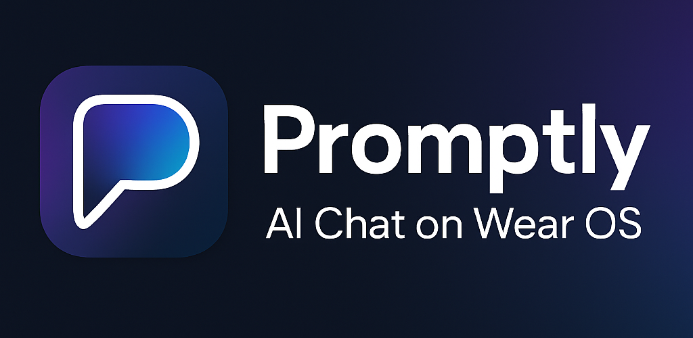
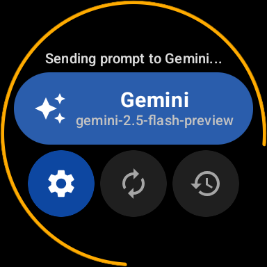
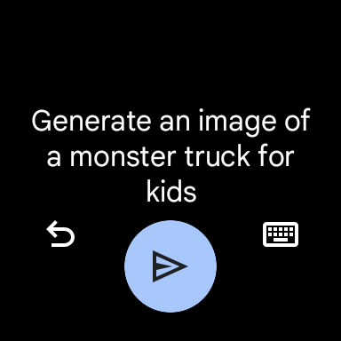
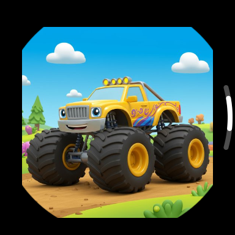

[![Stargazers][stars-shield]][stars-url]
[![Issues][issues-shield]][issues-url]

<!-- PROJECT LOGO -->
 

  

<h3 align="center">Promptly</h3>

  

    AI Chat on WearOS
     
    <a href="#documentation"><strong>Explore the docs »</strong></a>
     
     
    <a href="#demo">View Demo</a>
    &middot;
    <a href="https://github.com/tuxthepenguin84/promptly/issues/new?labels=bug&template=bug-report---.md">Report Bug</a>
    &middot;
    <a href="https://github.com/tuxthepenguin84/promptly/issues/new?labels=enhancement&template=feature-request---.md">Request Feature</a>
  

<!-- TABLE OF CONTENTS -->

  
Table of Contents

  <ol>
    <li><a href="#about">About</a></li>
    <li><a href="#features">Features</a></li>
    <li><a href="#demo">Demo</a></li>
    <li><a href="#screenshots">Screenshots</a></li>
    <li><a href="#getting-started">Getting Started</a></li>
    <li><a href="#documentation">Documentation</a></li>
    <li><a href="#known-issues">Known Issues</a></li>
    <li><a href="#faq">FAQ</a></li>
    <li><a href="#troubleshooting">Troubleshooting</a></li>
    <li><a href="#roadmap">Roadmap</a></li>
    <li><a href="#contact">Contact</a></li>
    <li><a href="#acknowledgments">Acknowledgments</a></li>
  </ol>

<!-- ABOUT -->

## About

  

Promptly is an AI Chat app designed specifically for WearOS devices, allowing you to interact with various AI models directly from your smartwatch. It offers a seamless and intuitive way to get quick answers, generate creative text & images, and manage your AI conversations on the go. The companion phone app facilitates transferring your API key to your WearOS device.

(<a href="#readme-top">back to top</a>)

<!-- FEATURES -->

## Features

Promptly provides a comprehensive set of features to bring the power of AI to your wrist:

- ✨ **Multi-AI Provider Support:** Connect to and switch between various AI providers, **Gemini, OpenAI, Anthropic, Grok, & Ollama**, allowing you to leverage different models for diverse needs.
- 🗣️ **Voice and Keyboard Input:** Easily input prompts using your voice or the on-screen keyboard for quick and convenient interaction.
- ✍️🖼️ **Text and Image Generation:** Generate both text-based responses and images directly from your smartwatch, expanding the possibilities of AI interaction.
- 📚 **Conversation History:** Keep track of your past interactions with AI, allowing you to review and revisit previous prompts and responses.
- 🧠 **Persistent Memory:** Enable the AI to remember specific information across conversations, leading to more personalized and contextually aware interactions.
- 🎭 **Customizable Personas:** Define unique roles or styles for the AI to adopt, influencing its tone and behavior to match your preferences.
- 🔧 **Flexible Settings:** Configure various aspects of the app, including AI model parameters (e.g., temperature, max tokens), history retention, and API key management.
- 📱 **Companion Phone App:** Transfer API keys from your phone to your watch, simplifying the setup process.

(<a href="#readme-top">back to top</a>)

<!-- DEMO -->

## Demo

### Text Generation

https://github.com/user-attachments/assets/ea2d9eb7-001f-46de-ba7d-695d440ed967

### Image Generation

https://github.com/user-attachments/assets/ec677d8f-0806-4176-947b-dbcd19b0136f

(<a href="#readme-top">back to top</a>)

<!-- SCREENSHOTS -->

## Screenshots

### Text Prompt

### Image Prompt

### Companion App

(<a href="#readme-top">back to top</a>)

<!-- GETTING STARTED -->

## Getting Started

_**Important:** Promptly requires you to provide your own API keys for the AI providers you wish to use. **The app will not function without valid API keys.**_

Obtain API Keys from various AI Providers: [Gemini](https://ai.google.dev/gemini-api/docs/api-key), [OpenAI](https://platform.openai.com/api-keys), [Anthropic](https://www.anthropic.com/api), [Grok](https://x.ai/api), [Ollama](https://github.com/ollama/ollama). When using Ollama, an API key is optional/not required.

1.  **Install Promptly WearOS App:** Download Promptly from the Google Play Store on your WearOS device.
1.  **Install Promptly Companion Phone App:** Download the Promptly companion app on your Android phone. This makes sending your API key to your watch fast and easy.
1.  **Send API Keys to Watch:** Open the companion phone app to easily enter and send your AI provider API keys to your watch. This avoids the need for manual typing on the small watch screen, although you _can_ manually type it out on the watch if you want too. I recommend using [Google Keep https://keep.google.com](https://keep.google.com) to easily input your API key on your computer to a note, then on your Android phone install [Google Keep on Android](https://play.google.com/store/apps/details?id=com.google.android.keep). Once you have Keep on your Android phone you can copy the API key, open the Promptly companion app, select your AI provider and paste your API key to send to the watch.
1.  **Verify API Keys on Watch:**
    1. Settings
    1. AI Providers
    1. Select your AI provider
    1. Configure API Key
    1. You should see part of your API key you sent with from the companion app
    1. Verify
1.  **Start Chatting:** Once your API keys are verified, you can start interacting with your chosen AI models directly from your WearOS device.

### Google Play Store Link

[Link to Google Play Store (Coming Soon!)]

### Promptly Companion App

[Link to Google Play Store (Coming Soon!)]

(<a href="#readme-top">back to top</a>)

<!-- DOCUMENTATION -->

## Documentation

This section provides a comprehensive guide to all features and settings within the Promptly app on your WearOS device.

### Home Screen

<table>
  <tbody>
    <tr>
      <td style="width: 220px;"></td>
      <td style="width: 500px;"><strong>Prompt Button:</strong> Tap to initiate voice input for your prompt or on-screen keyboard. Speak clearly, and the app will transcribe your words into text. <strong>Settings Cog:</strong> Access the main application settings, where you can configure AI providers, history, memory, and other app preferences. <strong>Cycle AI Providers:</strong> Cycle between the enabled AI providers. <strong>History Icon:</strong> Navigate to your prompt history, allowing you to review past conversations and AI responses.</td>
    </tr>
  </tbody>
</table>

### AI Providers

<table>
  <tbody>
    <tr>
      <td style="width: 220px;"></td>
      <td style="width: 500px;"><strong>Enable/Disable:</strong> Each AI provider can be enabled or disabled. To enable a provider, you must first add and verify a valid API key. <strong>Configure API Key:</strong> Add or Remove an API Key <strong>Change Model:</strong> Within a provider's settings, tap "Model" to select a different AI model if available. Different models may offer varied performance or capabilities. <strong>Model Settings:</strong> Temperature and max tokens.</td>
    </tr>
  </tbody>
</table>

### History

<table>
  <tbody>
    <tr>
      <td style="width: 220px;"></td>
      <td style="width: 500px;"><strong>Enable/Disable History:</strong> Toggle the Enable/Disable option in the History settings to control whether your conversations are saved locally on the watch. <strong>Configure Max History Items:</strong> Use the "Max History Items" slider to set the maximum number of past conversations the app will store. Older items will be automatically removed when this limit is reached. <strong>Clear History:</strong> Tap "Clear History" in the History settings to permanently delete all stored conversation history from your watch. This action cannot be undone.</td>
    </tr>
  </tbody>
</table>

### Memory

<table>
  <tbody>
    <tr>
      <td style="width: 220px;"></td>
      <td style="width: 500px;"><strong>What is Memory?:</strong> The memory feature allows the AI to retain specific pieces of information across different conversations. This helps the AI provide more personalized and contextually relevant responses over time. <strong>Add Memories:</strong> Tap "Add Memory", then type in any key information, facts, or preferences you want the AI to remember. Save your entry to add it to the AI's long-term memory. <strong>Delete Memories:</strong> Will remove all memories from the AI's long-term memory. This action cannot be undone.</td>
    </tr>
  </tbody>
</table>

### Persona

<table>
  <tbody>
    <tr>
      <td style="width: 220px;"></td>
      <td style="width: 500px;"><strong>Overview:</strong> Personas enable you to define a specific role, style, or set of characteristics for the AI. The app automatically incorporates your active persona into every prompt, influencing the AI's tone and behavior.</td>
    </tr>
  </tbody>
</table>

### Reset All Settings

<table>
  <tbody>
    <tr>
      <td style="width: 220px;"></td>
      <td style="width: 500px;"><strong>Revert all application settings:</strong> Revert all application settings, including AI provider configurations, API keys, history, memories, and personas, back to their default factory values. Please note that this action is irreversible and will clear all custom data.</td>
    </tr>
  </tbody>
</table>

(<a href="#readme-top">back to top</a>)

<!-- KNOWN ISSUES -->

## Known Issues

- **DNS lookups fail for locally hosted Ollama** - Promptly can access the Internet via cellular, WiFi, or Bluetooth over your phone when accessing AI providers. However, there is a limitation of WearOS where it will fail to do DNS lookups for **hostnames** within RFC1918 IP space (10.0.0.0/8, 172.16.0.0/12, 192.168.0.0/16) when using only Bluetooth over your phone, this limitation does not exist when using cellular or WiFi. You may run into this if you are hosting Ollama locally and your watch is connected to your phone via Bluetooth with WiFi or cellular disabled/off. The work around for this is to either disconnect Bluetooth and use WiFi or cellular, or instead configure the Ollama URL to use IP address rather than hostname/fqdn.

(<a href="#readme-top">back to top</a>)

<!-- FAQ -->

## FAQ

- **How can I generate images?** - Go to Settings, AI Providers, select your provider, Change Model, select an image generating model. On the Home Screen tap the provider and input a prompt. Sometimes you may have to phrase your request as _"Generate an image of ..."_

(<a href="#readme-top">back to top</a>)

<!-- TROUBLESHOOTING -->

## Troubleshooting

- **The companion phone app says "Watch Disconnected"** - Verify Bluetooth is enabled on your Android phone and your WearOS device. Open the [Google Pixel Watch](https://play.google.com/store/apps/details?id=com.google.android.apps.wear.companion) app, also called "Watch", on your Android phone and verify your watch shows as "Connected" then try again.

(<a href="#readme-top">back to top</a>)

<!-- ROADMAP -->

## Roadmap

- [ ] AI generated videos
- [ ] Additional AI providers

See the [open issues](https://github.com/tuxthepenguin84/promptly/issues) for a full list of proposed features (and known issues).

(<a href="#readme-top">back to top</a>)

<!-- CONTACT -->

## Contact

Project Link: [https://github.com/tuxthepenguin84/promptly](https://github.com/tuxthepenguin84/promptly)

(<a href="#readme-top">back to top</a>)

<!-- ACKNOWLEDGMENTS -->

## Acknowledgments

- [othneildrew/Best-README-Template](https://github.com/othneildrew/Best-README-Template)

(<a href="#readme-top">back to top</a>)

<!-- MARKDOWN LINKS & IMAGES -->
<!-- https://www.markdownguide.org/basic-syntax/#reference-style-links -->

[stars-shield]: https://img.shields.io/github/stars/tuxthepenguin84/promptly.svg?style=for-the-badge
[stars-url]: https://github.com/tuxthepenguin84/promptly/stargazers
[issues-shield]: https://img.shields.io/github/issues/tuxthepenguin84/promptly.svg?style=for-the-badge
[issues-url]: https://github.com/tuxthepenguin84/promptly/issues
[product-screenshot]: images/feature_graphic.png
